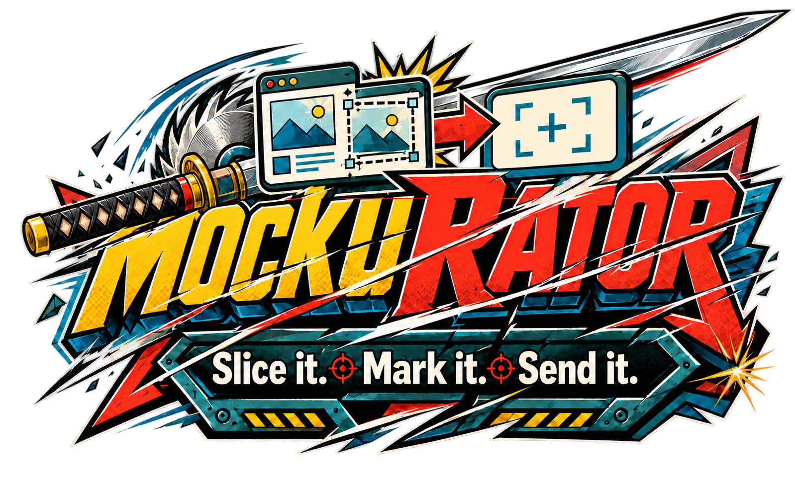

# MockuRATOR

> **Slice it. Mark it. Send it.**

MockuRATOR is a free, single-file browser tool for turning screenshots into clear visual feedback. Paste, drop, or open screenshots, slice out important sections, move and duplicate them, then mark them up with arrows, boxes, freehand pen, and text. Finished boards can be saved as JSON, reopened for regression comparisons, and exported as a PNG ready to paste into a chat, issue, or change request.

**Use it live:** https://pierrehunt.github.io/MockuRATOR/ — no install, no signup, nothing to configure.

<!-- Demo: record ~5 seconds with ScreenToGif (paste → slice → drag → arrow → export),
     upload it to this repo as demo.gif, then delete this comment block and uncomment the line below. -->
<!--  -->

## Why

Sending bugs and change requests to AI assistants (ChatGPT, Claude, Gemini, Grok…) or teammates often means pulling a screenshot apart: this card here, that section there, a red arrow on the problem. Doing that in a design suite — draw blocks, group, clip, ungroup, arrange — takes hours. MockuRATOR does it in minutes.

## Features

- **Paste, drop, or open** one or more screenshots (Ctrl+V works)
- **Slice** — drag a box around any section to cut it out as a free-moving piece; the original dims where you've already cut
- **Move** pieces anywhere; **duplicate** them for before/after comparisons
- **Annotate** with callout boxes, arrows, freehand pen, and text labels in five colours
- **One editor for everything** — click any piece, box, or arrow to open the **Selected** panel: note it, and for marks also recolour or toggle **Fill**. Pieces and marks both appear in the **Items** list, so you can always get back to any one of them — no hunting under overlapping boxes
- **Filled regions** — a translucent box fill highlights a whole section (sidebar, button row, a queue). Filled and captioned regions are the strongest report format: "red region = the sidebar, blue region = the buttons"
- **Notes on every item, in the report** — each piece and each mark carries its own note; the exported report.md lists them all, so "Piece 1: button misaligned" and "Filled region (red): the sidebar" travel as text the AI reads
- **Keyboard help** — press <kbd>?</kbd> any time for the full shortcuts overlay
- **Export PNG** — auto-named `project-date.png`, your notes printed underneath, and copied to the clipboard so you can paste it straight into a chat
- **Export Package** — one click bundles a `.zip` (named `project-date.zip`) containing the annotated **board.png**, a readable **report.md** the AI can parse (project, notes, and every text label you placed), and the reload **board.json**. Built with a tiny dependency-free ZIP writer — no libraries, still one file
- **Save / Load JSON** — the whole board (screenshots, slices, annotations, notes) in one file per project, so you can reopen it against the next build and track regressions
- **Side panel** — docked notes, a pieces list with thumbnails (click to select and jump to a piece), and a draggable **capture bookmarklet**: click it on any page, hover an element, click — it downloads that element as a PNG, pre-cut and ready to paste in. Every section has a ⇄ button to move it between the left and right side; the layout is remembered. Panels are drag-resizable at their inner edge, and the pieces list stretches to fill the column
- **Autosave + recent boards** — boards save automatically to your browser's local storage as you work; reopen them from the panel after closing the tab
- **100% client-side** — your screenshots never leave your machine (autosave lives in your own browser's storage). No server, no accounts, no tracking.

## Run it locally

No build step, no dependencies: download [`index.html`](index.html) (open it on GitHub → **Download raw file**) and double-click it. It works offline.

## Shortcuts

| Key | Action |
|---|---|
| `S` | Slice — drag a box around a section |
| `V` | Move pieces |
| `H` or hold `Space` | Pan the view |
| `B` / `A` / `P` / `T` | Box / Arrow / Pen / Text |
| Mouse wheel | Zoom |
| `Del` | Delete selected piece |
| `Ctrl+Z` | Undo |
| `Ctrl+D` | Duplicate selected piece |

## Regression workflow

1. Name the project, slice up the buggy build, annotate, **Save JSON**.
2. Next build: **Load JSON**, paste the new screenshot (it lands beside the old one), slice the same sections, and compare side by side.
3. **Export PNG** for the ticket or the chat. Your project folder becomes a dated trail of how each bug evolved.

## Notes

- Desktop-first: built for mouse and keyboard. It opens on phones, but pinch-zoom isn't wired up.
- The capture bookmarklet works on most sites; sites with a strict Content Security Policy block the injected capture script.
- Clipboard copy on export needs HTTPS — the live link above has it; the PNG download works everywhere, including straight from disk.

## About the name

The logo combines "Mock" from mockups with the exaggerated 1980s/90s cartoon-machine suffix "-RATOR", in the spirit of names like Battlenator and Bazookarator. The oversized sword represents slicing screenshots apart; the copy/paste panels, directional arrow, and callout box represent the core workflow: capture, separate, move, explain, and send.

## Changelog

- **1.5.2** — Lightweight social-preview card (WhatsApp and friends reject large preview images)
- **1.9.0** — Unified selection: pieces and marks share one editor and one Items list; every item (piece or mark) can carry its own note, listed per item in the report
- **1.8.0** — Selected-mark editor (caption + recolour + fill toggle); translucent filled regions; readable hint bar and a `?` shortcuts overlay
- **1.7.0** — Per-mark captions: click a box or arrow in Move mode to caption it; captions render on the board and group by mark in the report
- **1.6.0** — Export Package: one-click ZIP with the annotated PNG, an AI-readable report.md, and the reload JSON (dependency-free ZIP writer)
- **1.5.2** — Lightweight social-preview card for link sharing
- **1.5.1** — Credits: built with Anthropic's Claude; logo artwork by ChatGPT
- **1.5.0** — Brand identity (logo, icon, favicon), version stamped on exported PNGs and saved JSONs, semantic versioning in the header
- **1.1–1.4** — Side panel: docked notes, pieces list with thumbnails, capture bookmarklet, autosave and recent boards; movable, resizable panels
- **1.0** — First release

## Credits

- **Built with [Claude](https://claude.ai) by Anthropic** — the first working version went from idea to running tool in under an hour of conversation, and every release since (side panel, autosave, bookmarklet, versioning) shipped through the same chat.
- **Logo and icon artwork generated with ChatGPT** (OpenAI), from a Samurai-Jack-inspired brief.
- Made and maintained by [pierrehunt](https://github.com/pierrehunt).

## License

[MIT](LICENSE) — use it, fork it, ship it.
