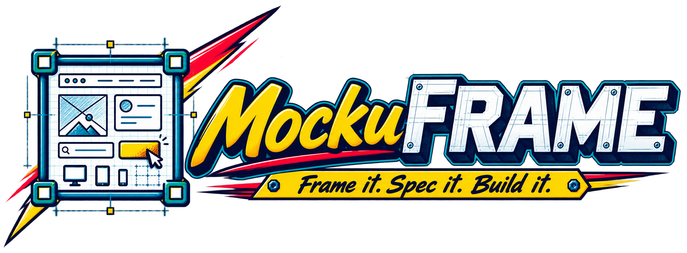
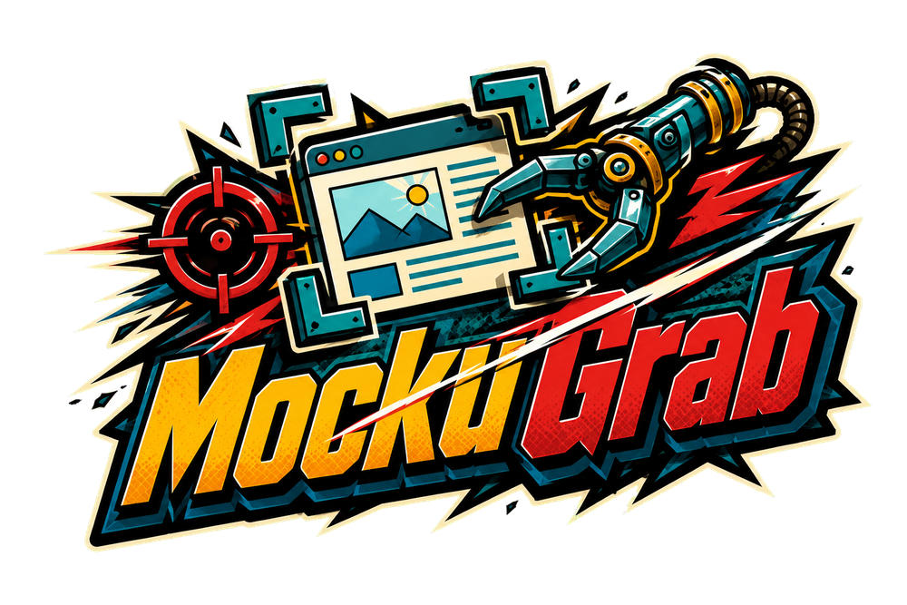
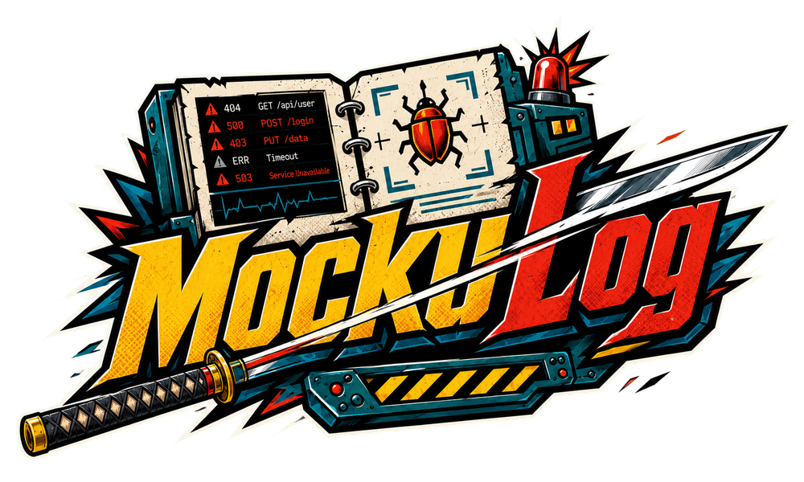

  

  
  &nbsp;
  

# MockuRATOR
**Slice it. Mark it. Send it.** — one HTML file, no install, no account, MIT.

**The bug report your AI can actually execute — and now, the wireframe that writes its own build spec.**

Every Export Package is one zip holding three files with a taught reading order: **board.png** (the annotated evidence), **report.md** (intent, geometry, severity, provenance — written *for* AI consumption), and **board.json** (machine-precise reload). Drop the zip into Claude, ChatGPT, Cursor — the report tells them how to read it. A built-in 🪲 recorder ([MockuLog](mockulog.js)) captures console errors and failed requests on any page and rides *inside* the package, so your screenshots arrive with their own telemetry. And the AI can **annotate back**: it appends reply-marks to board.json, you reload, and its answers appear pinned on your board. A reviewer and an AI holding a conversation in board space — nothing else does this.

---

**Frame it. Spec it. Build it.** — click **MockuFRAME** in the header (or press the tab) to switch modes. The same canvas, the same tools, a completely different purpose: design the UI *before* it exists. Drop Phone, Tablet, or Desktop screen frames, fill them with hand-sketched widgets, wire the screens with flow arrows, and export a build brief — a per-screen spec with every component's label, geometry, and behaviour note — that any AI can execute. A built-in UX conscience flags unlabeled widgets and missing notes in the panel *and* in the report, so the builder sees them too.

> Low-fidelity on purpose. Sketchy widgets say "argue about intent, not pixels." Balsamiq rents this. MockuFRAME is free, offline, and in the same file.

---

**Why not Jam / Marker / Excalidraw / Balsamiq?** They're good — at their organ. Jam captures console logs but ships them to a per-seat cloud. Excalidraw is a magnificent free canvas with no capture, telemetry, or spec output. Balsamiq rents rectangles plus metered AI credits. MockuRATOR is the whole organism, **without authority**: single file, works from file://, everything stays on your machine, no server even exists. Made *with* AI, *for* working with AI.

*Built by Pierre Hunt × Claude.*

## Why

Sending bugs and change requests to AI assistants (ChatGPT, Claude, Gemini, Grok…) or teammates often means pulling a screenshot apart: this card here, that section there, a red arrow on the problem. Doing that in a design suite — draw blocks, group, clip, ungroup, arrange — takes hours. MockuRATOR does it in minutes.

## Features

### 🆕 Wireframe mode — MockuFRAME
Design the UI **before** it exists. A palette of 16 hand-sketched widgets (button, input, select, checkbox, toggle, navbar, card, table…) drags straight onto the board — resize, group, and annotate them with the same tools you use on screenshots. **Double-click renames** a widget; its **note says what it does** ("submits to /api/orders"). Three starter layouts (Login, Dashboard, Settings) place whole screens in one click. The exported report gains a **"Screens & components" build spec** any AI can execute — plus a UX conscience: unlabeled widgets and missing behaviour notes are flagged in the panel *and* travel in the report, so the builder sees them too. Low-fidelity on purpose: sketchy widgets say "argue about intent, not pixels."

- **Paste, drop, or open** one or more screenshots (Ctrl+V works)
- **Slice** — drag a box around any section to cut it out as a free-moving piece; the original dims where you've already cut
- **Move** pieces anywhere; **duplicate** them for before/after comparisons
- **Annotate** with callout boxes, arrows, freehand pen, and text labels in five colours
- **🪲 MockuLog — F12 without F12** — a second bookmarklet records console errors, exceptions, and failed network calls on any page (no injected scripts, so it works even where CSP blocks MockuGrab). Click the pill, get a `.txt`, drop it on the board — it lists in Items, appears in the report, and ships inside the Export Package. For your own apps, [`mockulog.js`](mockulog.js) is a one-line drop-in that records from page load
- **🎤 Voice notes** — a mic button on every note field: click, speak, and your words appear as text while you talk (Web Speech, Chrome/Edge on the live site). Spelling optional, forever
- **Auto-context for the AI** — every report opens with a Context block: when it was made, the viewport, and where each screenshot came from — 📸 captures record the window they grabbed, MockuGrab files carry the page they came from in their name
- **📸 Capture any window** — one button opens the system picker: choose any application window (your desktop apps — Python, C#, anything), any browser tab, or a whole screen, and a crisp frame lands straight on the board. No screenshot tool, no save-and-reopen. Captures tabs even on sites whose security policy blocks the bookmarklet, because it photographs pixels instead of entering the page
- **Built-in tips** — the empty board shows a rotating "Did you know?" card walking through grouping, MockuGrab, packages, autosave and more; the full scrollable list lives in the <kbd>?</kbd> overlay
- **Group items into issues** — Ctrl-click several rows in Items, hit **Group**: one note and one colour for all of them, one caption pill on the board, and the report writes a single "Issue: … — shown by 4 arrows" line instead of four repeats. New marks drawn while a group is selected join it and inherit its colour. Ungroup any time
- **Marks are fully editable** — drag a selected box to move it, pull its corners to resize, re-aim arrows by their endpoints or **Reverse** them, and text labels are first-class too: select, drag, A−/A+ resize, recolour, rewrite. Every transform is undoable
- **One editor for everything** — click any piece, box, or arrow to open the **Selected** panel: note it, and for marks also recolour or toggle **Fill**. Pieces and marks both appear in the **Items** list, so you can always get back to any one of them — no hunting under overlapping boxes
- **Filled regions** — a translucent box fill highlights a whole section (sidebar, button row, a queue). Filled and captioned regions are the strongest report format: "red region = the sidebar, blue region = the buttons"
- **Notes on every item, in the report** — each piece and each mark carries its own note; the exported report.md lists them all, so "Piece 1: button misaligned" and "Filled region (red): the sidebar" travel as text the AI reads
- **Keyboard help** — press <kbd>?</kbd> any time for the full shortcuts overlay
- **Export PNG** — auto-named `project-date.png`, your notes printed underneath, and copied to the clipboard so you can paste it straight into a chat
- **Export Package** — one click bundles a `.zip` (named `project-date.zip`) containing the annotated **board.png**, a readable **report.md** the AI can parse (project, notes, and every text label you placed), and the reload **board.json**. Built with a tiny dependency-free ZIP writer — no libraries, still one file
- **Save / Load JSON** — the whole board (screenshots, slices, annotations, notes) in one file per project, so you can reopen it against the next build and track regressions
- **Side panel** — docked notes, a pieces list with thumbnails (click to select and jump to a piece), and a draggable **capture bookmarklet**: click it on any page, hover an element, click — it downloads that element as a PNG, pre-cut and ready to paste in. Every section has a ⇄ button to move it between the left and right side; the layout is remembered. Panels are drag-resizable at their inner edge, and the pieces list stretches to fill the column
- **Autosave + recent boards** — boards save automatically to your browser's local storage as you work; reopen them from the panel after closing the tab
- **100% client-side** — your screenshots never leave your machine (autosave lives in your own browser's storage). No server, no accounts, no tracking.

## Run it locally

No build step, no dependencies: download [`index.html`](index.html) (open it on GitHub → **Download raw file**) and double-click it. It works offline.

## Shortcuts

| Key | Action |
|---|---|
| `S` | Slice — drag a box around a section |
| `V` | Move pieces |
| `H` or hold `Space` | Pan the view |
| `B` / `A` / `P` / `T` | Box / Arrow / Pen / Text |
| Mouse wheel | Zoom |
| `Del` | Delete selected piece |
| `Ctrl+Z` | Undo |
| `Ctrl+D` | Duplicate selected piece |

## Regression workflow

1. Name the project, slice up the buggy build, annotate, **Save JSON**.
2. Next build: **Load JSON**, paste the new screenshot (it lands beside the old one), slice the same sections, and compare side by side.
3. **Export PNG** for the ticket or the chat. Your project folder becomes a dated trail of how each bug evolved.

## Notes

- Desktop-first: built for mouse and keyboard. It opens on phones, but pinch-zoom isn't wired up.
- 📸 Capture uses the browser's screen-share picker — it works on the live HTTPS site (or localhost), not when the file is opened from disk. It grabs what's visible; for full-page scrolling captures use the bookmarklet or a full-page tool.
- The capture bookmarklet works on most sites; sites with a strict Content Security Policy block the injected capture script.
- Clipboard copy on export needs HTTPS — the live link above has it; the PNG download works everywhere, including straight from disk.

## Hand it to your AI

Ready-made prompts — one-click copies live in the panel beside each bookmarklet:

> **With an Export Package:** "I'm attaching a MockuRATOR package. Read report.md first — every mark and issue is explained there, with context about where each screenshot came from. Then study board.png. Address each issue one by one and tell me exactly what you changed, per issue."

> **With a MockuLog file:** "Attached is a console/network log captured with MockuLog. List every distinct error, its likely root cause, and the exact fix — ordered by severity. Ignore warnings unless they explain an error."

> **With both together:** "This zip holds my annotated screenshot, my notes, and a console log. Cross-reference them: which of the visual issues I marked are explained by errors in the log? Then fix each, telling me what you changed."

## The family

**MockuFRAME** is the wireframing mode built into MockuRATOR — click the tab in the header to switch. Drop screen frames (Phone, Tablet, Desktop), fill them with sketchy widgets, wire the flows, and export a build brief that any AI can execute.

  
  

**MockuGrab** captures any element on any page as a pre-cut PNG. **MockuLog** records console errors and failed requests without ever opening DevTools. Both live in the side panel as drag-to-bookmarks buttons, and both feed the same Export Package.

## About the name

The logo combines "Mock" from mockups with the exaggerated 1980s/90s cartoon-machine suffix "-RATOR", in the spirit of names like Battlenator and Bazookarator. The oversized sword represents slicing screenshots apart; the copy/paste panels, directional arrow, and callout box represent the core workflow: capture, separate, move, explain, and send.

## Changelog

- **1.25.5** — Sticky chip mode is now intentional: armed chip stays armed across placements; **Esc** releases it back to Move (toast + hintBar both tell you so); chip and frame toasts say "Esc when done"
- **1.25.4** — Download-first: a prominent **⬇ Open in browser / Download for offline** button pair at the top of the README; a **⬇ Get app** button in the header fetches the live page source and saves it as `MockuRATOR.html` (fallback to GitHub raw URL when running from file://); MockuFRAME section added to README hero and to The family; wireframe features heading cleaned up
- **1.25.3** — MockuFRAME gets its own hero section in the README — logo at full width, own tagline, direct Balsamiq comparison; The family section updated with MockuFRAME leading
- **1.25.2** — Items list compacted (40% less vertical space per row — tighter padding, smaller icons, shorter labels); drop-hint correctly hides when a widget chip is placed; MockuFRAME mode-tab UX polished
- **1.25.1** — Mode toggle moves to the header: **MockuRATOR \| MockuFRAME** pill tabs always visible; panel completely reorganises on switch (annotate rail: Companion/Grab/Log/Recent; wireframe rail: widgets/frames/templates/rails/Recent); Slice hidden in MockuFRAME toolbar; hintBar and dropHint both mode-aware

- **1.25.0** — Four threads shipped in one release: **Device frames** (📱 Phone · 📲 Tablet · 🖥️ Desktop screen containers — place from chip or drag; widgets inside move with the screen; rename by double-clicking the name strip; report writes per-screen sections with relative coords and a Backstage catch-all); **Template packs** (five built-in multi-screen starters — Auth ×3, SaaS shell, Shop ×4, Landing, Pricing — plus a droppable `mockurator-template` JSON format so teams can share packs as plain files); **Guide-rail engine** (five toggleable UX-conscience checks — one primary action per screen, tap targets ≥ 36 px, label contrast, unlabeled widgets, missing behaviour notes — live in the panel, written into the report export); **Reply-back v2** (every mark ships with a stable `id`; AI reply marks add `"re":"<id>"` and MockuRATOR draws a dashed thread connector back to the original; the report lists `↳ replying to` thread lines); plus 17 test suites all green
- **1.24.1** — Infrastructure release: the full test battery (13 suites, 150+ checks) now lives in `tests/` — `node tests/run.js` runs everything with a syntax smoke first; suites read the app version from source so stale-version fake-FAILs are extinct; section banners in index.html; ARCHITECTURE.md and DEMO-SCRIPT.md added; README repositioned around what nothing else does
- **1.24.0** — MockuFRAME breathes: the wireframe side gets its name (wordmark swaps in mode), marquee group-select (drag empty canvas in Move), eight alignment tools (align edges/centers + distribute with equal gaps), and 👁 Device Preview — the board in desktop, tablet, and phone frames at true relative scale
- **1.23.0** — The consumer´s five notches (review by the receiving AI): caption pills wrap and never truncate in exports; report.md carries exact geometry for every mark and Issue region; type + severity tags (bug/enhancement/question/praise · low→critical); Page URL field maps screenshots to routes; and the AI reply-back convention — an AI can append its own marks to board.json (by:"ai") and you reload the conversation onto the board
- **1.22.0** — Enter Wireframe Mode: one click focuses the whole UX for design (capture tools tuck away, dot grid appears, widgets snap to an 8px grid); widgets can join groups; palette lives below MockuLog
- **1.21.0** — 🎉 Wireframe mode: 16 sketch-dialect widgets, drag-to-place, in-place rename, behaviour notes, starter layouts, spec-flavoured report with UX conscience — the balsamic release
- **1.20.0** — 🎨 Colour themes: Paper, High contrast (glasses-friendly), Dark, and Katana — one header button cycles and remembers; the canvas mat and exports stay light so marks stay readable
- **1.19.0** — Overall Notes tops the panel; Recent Boards joins the right rail below the tools; groups can now adopt: select a group, Ctrl-click items, Add — note and colour extend automatically
- **1.18.0** — Compact panel: each tool is one button plus an ⓘ modal holding the full guide and copy buttons (your own frontend pattern, returned with thanks); Ctrl-click grouping now counts the already-selected item automatically
- **1.17.5** — MockuSnap grows into the 🧰 MockuRATOR Companion: one extension with full-page Snap, element Grab (CSP-proof), and one-click MockuLog injection, plus a Chrome Web Store submission kit
- **1.17.4** — 📸 MockuSnap: our own full-page-screenshot Chrome extension (one click, whole page, no stitching, load-unpacked, hosted in the repo); panel cleanup with tidy button rows and a proper MockuLog explainer; drawing while a group is selected no longer auto-joins the group
- **1.17.3** — Clearer prompt buttons (package / analysis / install), hardened analysis prompt that catches wrong-file attachments, new AI install prompt, and version-stamped MockuLog recorders
- **1.17.2** — mockulog.js is a real link in the panel; one-click "Copy AI prompt" buttons beside both bookmarklets; hand-off prompts in the ? overlay and README
- **1.17.1** — Text polish: the entry box is WYSIWYG (true size and colour, aligned where the label lands), new labels auto-select, double-click any label to edit it in place, double-click empty canvas for a quick label
- **1.17.0** — Text labels are first-class items: selectable, draggable, resizable, recolourable, editable, listed in Items
- **1.16.3** — Text tool fixed: the browser was blurring the label input the instant it opened; typing also now commits on click-away instead of being discarded
- **1.16.2** — Handles are live in every tool (visible means grabbable), hover cursors everywhere, and selecting from Items switches to Move
- **1.16.1** — Resize handles now actually grabbable: wide hit radius, bigger handles, hover cursors; family logos for MockuGrab and MockuLog
- **1.16.0** — Mark transforms: move, corner-resize, arrow re-aim and Reverse; bookmarklets now default to the right panel
- **1.15.0** — 🪲 MockuLog: console/network recorder bookmarklet plus drop-in mockulog.js; log files attach to the board and ship inside the Export Package
- **1.14.0** — 🎤 voice dictation on every note field; auto-context block in reports (viewport, timestamps, per-screenshot provenance); MockuGrab filenames now carry the source page
- **1.13.0** — 📸 Capture: grab any application window, browser tab, or screen via the system picker, straight onto the board
- **1.12.0** — Rotating tips card on the empty board plus a full tips list in the ? overlay — the powerful features now introduce themselves
- **1.11.0** — Groups: multi-select items into one issue with a shared note and inherited colour; single caption on the board; grouped "Issues" section in the report
- **1.10.1** — Changelog repair: removed a duplicate, mis-ordered 1.5.2 entry
- **1.10.0** — Prominent auto-focused note field on every selection; global notes relabelled "Overall"; Items flags how many still need a note, and Export Package warns before sending an un-noted board
- **1.9.0** — Unified selection: pieces and marks share one editor and one Items list; every item (piece or mark) can carry its own note, listed per item in the report
- **1.8.0** — Selected-mark editor (caption + recolour + fill toggle); translucent filled regions; readable hint bar and a `?` shortcuts overlay
- **1.7.0** — Per-mark captions: click a box or arrow in Move mode to caption it; captions render on the board and group by mark in the report
- **1.6.0** — Export Package: one-click ZIP with the annotated PNG, an AI-readable report.md, and the reload JSON (dependency-free ZIP writer)
- **1.5.2** — Lightweight social-preview card (messengers reject large preview images)
- **1.5.1** — Credits: built with Anthropic's Claude; logo artwork by ChatGPT
- **1.5.0** — Brand identity (logo, icon, favicon), version stamped on exported PNGs and saved JSONs, semantic versioning in the header
- **1.0–1.4** — The founding week-end: slice/move/pan tools, box/arrow/pen marks, five colours, Export PNG, Save/Load JSON, panels, first Export Package
- **1.1–1.4** — Side panel: docked notes, pieces list with thumbnails, capture bookmarklet, autosave and recent boards; movable, resizable panels
- **1.0** — First release

## Credits

- **Built with [Claude](https://claude.ai) by Anthropic** — the first working version went from idea to running tool in under an hour of conversation, and every release since (side panel, autosave, bookmarklet, versioning) shipped through the same chat.
- **Logo and icon artwork generated with ChatGPT** (OpenAI), from a Samurai-Jack-inspired brief.
- Made and maintained by [pierrehunt](https://github.com/pierrehunt).

## License

[MIT](LICENSE) — use it, fork it, ship it.
